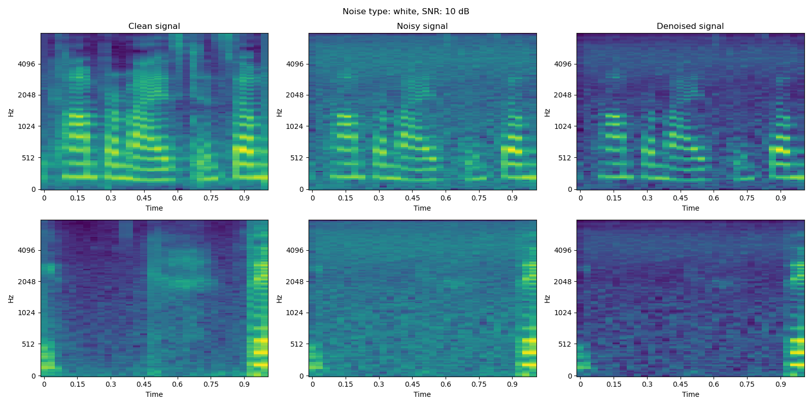

# NMF-based Speech Enhancement for WI24 CSE 203B

## Introduction
This project paper sets out to tackle the challenge of speech enhancement by leveraging the principles of dictionary learn- ing and lasso sparse coding, a method rooted in convex optimization, to systematically decompose and reconstruct audio signals for clearer and more intelligible speech output.

## Speech Enhancement Result on LibriSpeech


## Getting Started

### Install Requirements
```
pip install -r requirements.txt
```

### Download and Pre-process data
We use "clean" speech development set from [LibriSpeech ASR Corpus](https://www.openslr.org/12/) for clean target speech. 
```
mkdir data
cd data
wget https://us.openslr.org/resources/12/dev-clean.tar.gz .
```

`preprocess_data.py` will perform voice activity detection, resampling, downmixing, and segmenting the speech data with desired sampling rate and duration.
```
cd src
python preprocess_data.py
```

### Train and Evaluation
We used `src/speech_enhancement_dict.py` for the final submission. This code utilizes `DictionaryLinearing` class of `scikit-learn` to learn non-negative dictionary and sparse coding. The enhancement is done in spectro-temporal dimension using Mel spectrogram of speech segments. This analysis makes PESQ (Perceptual Evaluation of Speech Quality) incorrect, because estimation of inverse transformation from mel scale to normal frequency and a lack of phase information result in inaccurate 1d-waveform conversion from Mel spectrogram.